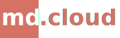

<p align="center">
  
</p>

An attempt at creating the most flexible, secure, and reliable markdown editor hosted in the cloud or as your own instance.

### Features

 - [x] Dropbox Integration
 - [x] Client side encryption with AES
 - [x] Online editor
 - [x] Inline images

## Installation

To use the editor, simply go to [markdown.cloud/](https://markdown.cloud/).<br />

If you want to host your own, you can follow these instructions:

### Configure environment variables

You simply need two environment variables, preferably in a file names `.env` inside the root folder:

 1. `REACT_APP_DBX_CLIENT_ID`
 2. `REACT_APP_DBX_REDIRECT_URL`

You can get these values by going to the Dropbox Developer page and registering your own application.

### Development

Run a development version using yarn.

```
yarn install
yarn start
```

Yarn will automatically find the `.env` file and set the environment variables.

### Cloudflare Worker

The project is setup such that it can be deployed easily to Cloudflare Workers.

Follow the Cloudflare documentation to install and configure the wrangler CLI.

Change these values in the `wrangle.toml`-file to as such:
```
workers_dev = true
route = ""
```

Run `wrangler publish` to deploy the application.

## License

The project is under and MIT license.
